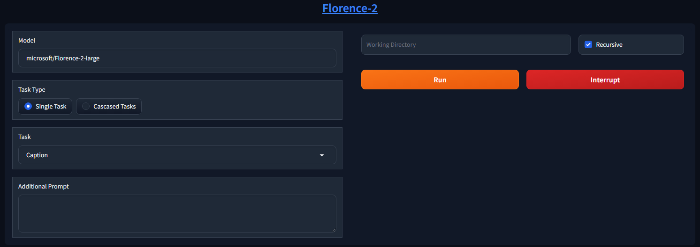

# Forge Space Batch Florence-2
This is a modified version of the built-in [Florence-2](https://github.com/lllyasviel/stable-diffusion-webui-forge/tree/main/extensions-builtin/forge_space_florence_2) Space for the [Forge Webui](https://github.com/lllyasviel/stable-diffusion-webui-forge), now updated to batch-process all images in a folder.

## How to Use
- Enter a path to the folder containing the images to process
    - Enable `Recursive` to also process images in the sub-folders
- `Task` that outputs a single line of text will write to the same filename with `.txt` extension
- `Task` that outputs a complex structure will write to the same filename with `.json` extension
- `Task` that outputs an image will save to the same filename with `_bbox.png` suffix

> [!TIP]
> Refer to the official [HuggingFace](https://huggingface.co/microsoft/Florence-2-large) page to see what each `Task` does and how you should use the `Additional Prompt`
